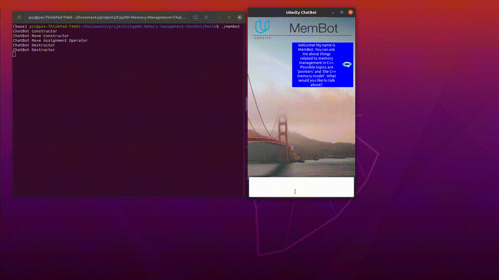

# CPPND: Memory Management Chatbot

This is the project for the third course in the [Udacity C++ Nanodegree Program](https://www.udacity.com/course/c-plus-plus-nanodegree--nd213): Memory Management.


The ChatBot code creates a dialogue where users can ask questions about some aspects of memory management in C++. After the knowledge base of the chatbot has been loaded from a text file, a knowledge graph representation is created in computer memory, where chatbot answers represent the graph nodes and user queries represent the graph edges. After a user query has been sent to the chatbot, the Levenshtein distance is used to identify the most probable answer. The code is fully functional as-is and uses raw pointers to represent the knowledge graph and interconnections between objects throughout the project.

In this project we analyze and modify the program utilizing smart pointers, move semantics and explicitly paying attention to the ownership.

We use the course knowledge to optimize the ChatBot program from a memory management perspective. There are a total of five specific tasks to be completed, which are detailed below.

## My Linux System
* Ubuntu 20.04.2 LTS

## Dependencies for Running Locally
* cmake >= 3.11
  * All OSes: [click here for installation instructions](https://cmake.org/install/)
* make >= 4.1 (Linux, Mac), 3.81 (Windows)
  * Linux: make is installed by default on most Linux distros
  * Mac: [install Xcode command line tools to get make](https://developer.apple.com/xcode/features/)
  * Windows: [Click here for installation instructions](http://gnuwin32.sourceforge.net/packages/make.htm)
* gcc/g++ >= 5.4
  * Linux: gcc / g++ is installed by default on most Linux distros
  * Mac: same deal as make - [install Xcode command line tools](https://developer.apple.com/xcode/features/)
  * Windows: recommend using [MinGW](http://www.mingw.org/)
* wxWidgets >= 3.0
  * Linux: `sudo apt-get install libwxgtk3.0-dev libwxgtk3.0-0v5`. If you are facing unmet dependency issues, refer to the [official page](https://wiki.codelite.org/pmwiki.php/Main/WxWidgets30Binaries#toc2) for installing the unmet dependencies.
  * Mac: There is a [homebrew installation available](https://formulae.brew.sh/formula/wxmac).
  * Installation instructions can be found [here](https://wiki.wxwidgets.org/Install). Some version numbers may need to be changed in instructions to install v3.0 or greater.


## Basic Build Instructions

1. Clone this repo.
2. Make a build directory in the top level directory: `mkdir build && cd build`
3. Compile: `cmake .. && make`
4. Run it: `./membot`.

## Project Task Details

### Task 1 : Exclusive Ownership 1
In file `chatgui.h` / `chatgui.cpp`, make `_chatLogic` an exclusive resource to class `ChatbotPanelDialog` using an appropriate smart pointer. Where required, make changes to the code such that data structures and function parameters reflect the new structure. 

Within chatgui.h check [line 26](https://github.com/prasadshingne/CppND-Memory-Management-Chatbot/blob/1771aee680ebba678af7262225ce27b64c23c3a6/src/chatgui.h#L26) and check [lines 124-146](https://github.com/prasadshingne/CppND-Memory-Management-Chatbot/blob/1771aee680ebba678af7262225ce27b64c23c3a6/src/chatgui.cpp#L124) in chatgui.cpp.

### Task 2 : The Rule Of Five
In file `chatbot.h` / `chatbot.cpp`, make changes to the class `ChatBot` such that it complies with the Rule of Five. Make sure to properly allocate / deallocate memory resources on the heap and also copy member data where it makes sense to you.  In each of the methods (e.g. the copy constructor), print a string of the type "ChatBot Copy Constructor" to the console so that you can see which method is called in later examples. 

Within chatbot.h [lines 36-45](https://github.com/prasadshingne/CppND-Memory-Management-Chatbot/blob/1771aee680ebba678af7262225ce27b64c23c3a6/src/chatbot.h#L36) implements the declerations for rule of 5. [Lines 50-115](https://github.com/prasadshingne/CppND-Memory-Management-Chatbot/blob/master/src/chatbot.cpp#L50) completes the definitions for the rule of 5.

### Task 3 : Exclusive Ownership 2
In file `chatlogic.h` / `chatlogic.cpp`, adapt the vector `_nodes` in a way that the instances of `GraphNodes` to which the vector elements refer are exclusively owned by the class `ChatLogic`. Use an appropriate type of smart pointer to achieve this. Where required, make changes to the code such that data structures and function parameters reflect the changes. When passing the `GraphNode` instances to functions, make sure to not transfer ownership and try to contain the changes to class `ChatLogic` where possible. 

In chatlogic.h declare a vector of unique_ptr of GraphNode in [line 27](https://github.com/prasadshingne/CppND-Memory-Management-Chatbot/blob/1771aee680ebba678af7262225ce27b64c23c3a6/src/chatlogic.h#L27) within class Chatlogic. We use this vector in chatlogic.cpp as shown in [lines 133-139](https://github.com/prasadshingne/CppND-Memory-Management-Chatbot/blob/master/src/chatlogic.cpp)

### Task 4 : Moving Smart Pointers

In files `chatlogic.h` / `chatlogic.cpp` and `graphnode.h` / `graphnode.cpp` change the ownership of all instances of `GraphEdge` in a way such that each instance of `GraphNode` exclusively owns the outgoing `GraphEdges` and holds non-owning references to incoming `GraphEdges`. Use appropriate smart pointers and where required, make changes to the code such that data structures and function parameters reflect the changes. When transferring ownership from class `ChatLogic`, where all instances of `GraphEdge` are created, into instances of `GraphNode`, make sure to use move semantics. 

In graphnode.h declare a vector of unique_ptr of GraphEdge in [line 22](https://github.com/prasadshingne/CppND-Memory-Management-Chatbot/blob/1771aee680ebba678af7262225ce27b64c23c3a6/src/graphnode.h#L22) within class GraphNode. The corresponding changes in graphnode.cpp are on [lines 35-38](https://github.com/prasadshingne/CppND-Memory-Management-Chatbot/blob/1771aee680ebba678af7262225ce27b64c23c3a6/src/graphnode.cpp#L35) and [lines 59-70](https://github.com/prasadshingne/CppND-Memory-Management-Chatbot/blob/1771aee680ebba678af7262225ce27b64c23c3a6/src/graphnode.cpp#L59). Corresponding changes in chatlogic.cpp are on [lines 165-174](https://github.com/prasadshingne/CppND-Memory-Management-Chatbot/blob/1771aee680ebba678af7262225ce27b64c23c3a6/src/chatlogic.cpp#L165). Move semantics is used to transfer ownership from class Chatlogic to GraphNode in [line 184](https://github.com/prasadshingne/CppND-Memory-Management-Chatbot/blob/1771aee680ebba678af7262225ce27b64c23c3a6/src/chatlogic.cpp#L184).

### Task 5 : Moving the ChatBot

In file `chatlogic.cpp`, create a local `ChatBot` instance on the stack at the bottom of function `LoadAnswerGraphFromFile`. Then, use move semantics to pass the `ChatBot` instance into the root node. Make sure that `ChatLogic` has no ownership relation to the `ChatBot` instance and thus is no longer responsible for memory allocation and deallocation. Note that the member `_chatBot` of `ChatLogic` remains so it can be used as a communication handle between GUI and `ChatBot` instance. Make all required changes in files `chatlogic.h` / `chatlogic.cpp` and `graphnode.h` / `graphnode.cpp`. When the program is executed, messages on which part of the Rule of Five components of `ChatBot` is called should be printed to the console. When sending a query to the `ChatBot`, the output should look like the following: 

```
ChatBot Constructor
ChatBot Move Constructor
ChatBot Move Assignment Operator
ChatBot Destructor
ChatBot Destructor 
```

An instance of ChatBot is created within LoadAnswerGraphFromFile and pass it to root node on [lines 232-238](https://github.com/prasadshingne/CppND-Memory-Management-Chatbot/blob/1771aee680ebba678af7262225ce27b64c23c3a6/src/chatlogic.cpp#L232). Corresponding change in graphnode.cpp on [lines 43-55](https://github.com/prasadshingne/CppND-Memory-Management-Chatbot/blob/1771aee680ebba678af7262225ce27b64c23c3a6/src/graphnode.cpp#L43).

## Output looks like:
